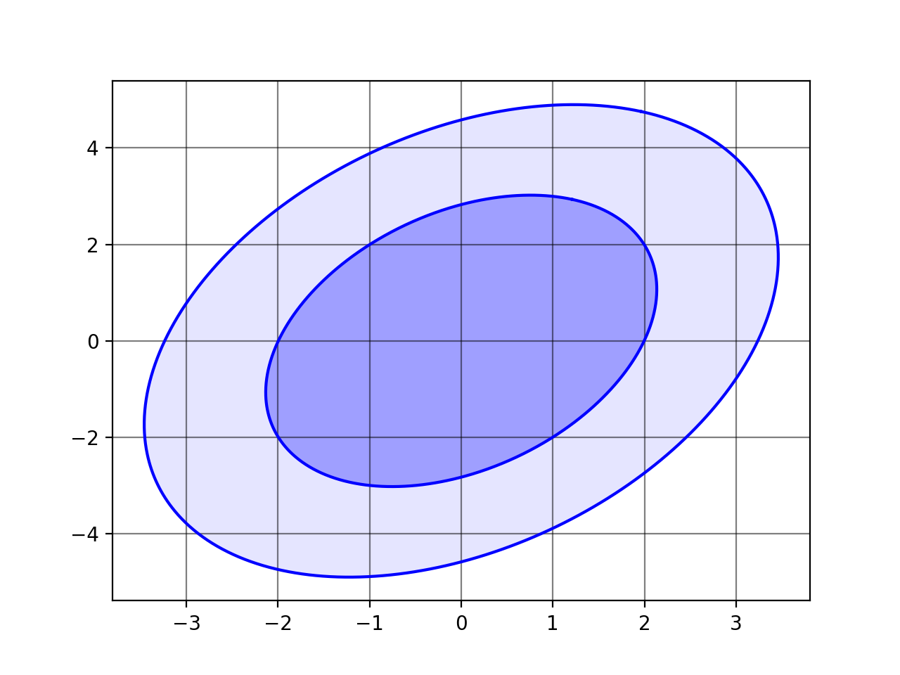

## plot_ellipse.py


### An easy-to-use function for plotting 2D ellipses in Python 2.7 with matplotlib.
#### For example:
```python
#!/usr/bin/env python
from plot_ellipse import plot_ellipse
import matplotlib.pyplot as plt
import numpy as np

fig,ax = plt.subplots()
plot_ellipse(x_cent=0, y_cent=0, semimaj=2, semimin=1, phi=np.pi/4, ax=ax)
plt.show()
```


or

```python
#!/usr/bin/env python
from plot_ellipse import plot_ellipse
import matplotlib.pyplot as plt
import numpy as np

C = np.array([[2, 1],[1, 4]])

fig,ax = plt.subplots()
ax.grid(True)
plot_ellipse(x_cent=0, y_cent=0, cov=C, mass_level=0.68, fill=True, ax=ax, fill_kwargs={'alpha':0.2})
plt.show()
```



#### Features
- It can interface with plt.fill()
- It can directly take a 2x2 covariance matrix (numpy ndarray) and will plot probability contours

#### Installation
To install, simply clone this repo and run the `setup.py` script
```bash
python setup.py install
```
